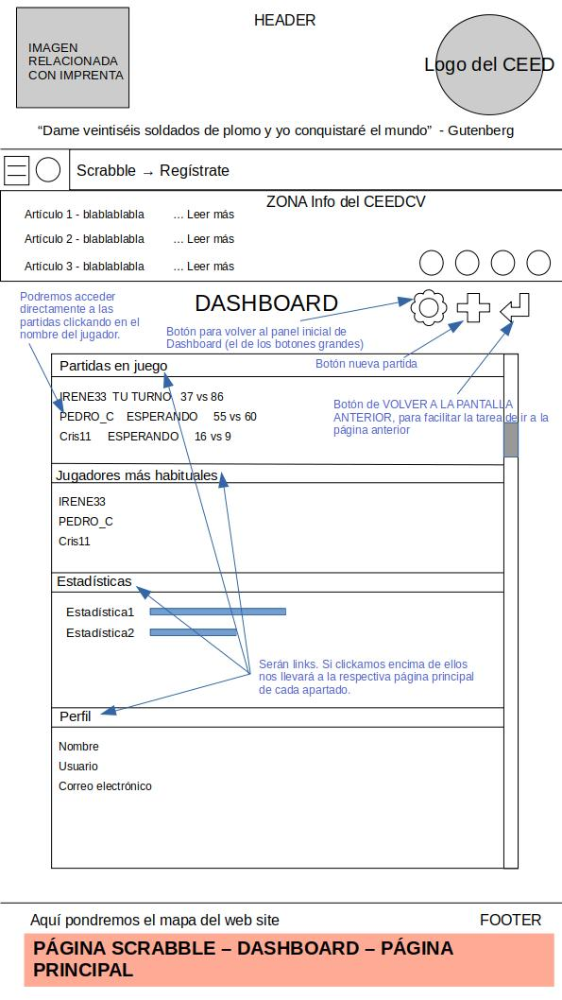
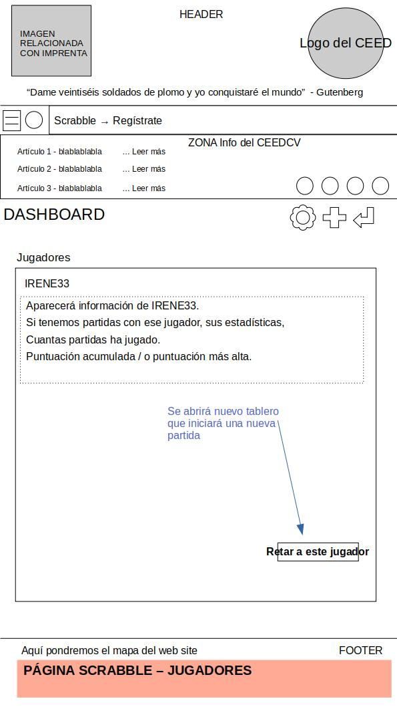

# PLANIFICACIÓN DEL PROYECTO

## 1. PERSONAS - PERFILES DE USUARIO

A través de esta definición de personas, se pretende posibles perfiles de usuario de la página.

El cliente solicita lo siguiente:
INFORMACIÓN HISTÓRICA SOBRE LA IMPRENTA: estudiantes de Bachiller y GES a distancia de entre 18 y 60 años.
ÁREA JUEGO SCRABBLE: todo tipo de usuarios entre 10 y 99 años, que pueden ser estudiantes del CEED o no. Buscan un juego sencillo con el que pasar un buen rato y quitarse el aburrimiento.

#### **PERFIL A**
| **Datos**           | **Contenido**                 |
| :-------------------| :-----------------------------|
| **Nombre** | Consuelo |
| **Edad** | 55 |
| **Estudios Actualmente** | Estudiando GES a distancia en el CEED |
| **Ocupación** | Ama de casa |
| **Descripción “persona”** | Consuelo es madre de 3 hijos de 30, 28 y 22 años. Dejó los estudios en su juventud por ponerse a trabajar, se casó y tuvo hijos pronto. Hace tres años Consuelo se divorció y el año pasado decidió volver a ponerse a estudiar. Sus hijos de 28 y 22 aun viven con ella, el mayor trabaja y la pequeña estudia. Tienen dos ordenadores en casa, que la mayor parte del tiempo acaparan sus hijos y ella solo puede utilizarlos en los ratos libres. La experiencia de Consuelo con los ordenadores se limita al uso de ellos para buscar información por internet, pero desde que el año pasado empezó a estudiar, ha hecho varios cursos para utilizar herramientas de ofimática.
| **Escenario** | Son las 22:15h, Consuelo ha terminado de hacer las cenas, sus hijos ya han cenado y están viendo la tele; por lo que es una de las pequeñas franjas horarias que tiene disponible entre semana para utilizar el ordenador. Se sienta en la mesa a ver si le han subido contenido nuevo en el aula virtual y a revisar los foros de cada asignatura. Le echa un ojo por encima, porque está cansada. A la vez, navega en internet buscando información aleatoria. |

#### **PERFIL B**
| **Datos**           | **Contenido**                 |
| :-------------------| :-----------------------------|
| **Nombre** | Pablo |
| **Edad** | 36 |
| **Estudios Actualmente** | Actualmente estudiando Bachillerato Ciencias Puras en CEED |
| **Ocupación** | Electricista |
| **Descripción “persona”** | Pablo es padre de una niña de 3 años. Está casado, y su mujer es contable en una gestoría. Pablo hizo un FP medio de electricidad  hace muchos años, y trabaja actualmente como tal. Tiene un horario de 8:00 – 17:00 en su puesto de trabajo, y quiere optar a un ascenso dentro de su misma empresa, pero necesita tener  bachillerato. |
| **Escenario** | Pablo ha salido a las 17:00 de trabajar y pasa directamente a recoger a su hija de la guardería. Llegan a casa y tras preparar la merienda a su hija, se sienta en el ordenador que tienen en el comedor mientras la cuida. Pablo tiene que acabar unos ejercicios de matemáticas y se sienta a estudiar, con lápiz y papel, frente al ordenador, donde tiene los enunciados y la teoría.|

#### **PERFIL C**
| **Datos**           | **Contenido**                 |
| :-------------------| :-----------------------------|
| **Nombre** | Mamadou |
| **Edad** | 23 |
| **Estudios Actualmente** | Actualmente estudiando Bachillerato Ciencias Sociales en CEED |
| **Ocupación** | Rider |
| **Descripción “persona”** | Mamadou es soltero. Llegó a España desde Senegal con 19 años y sin saber hablar español. En Senegal completó la equivalencia en España al GES, pudiendo convalidar los estudios con los de España. Mamadou estudió español en el CEED, y vio la oferta formativa que existía para estudiar online. Trabaja como Rider y vive en un piso compartido con 2 personas más. Tiene su ordenador personal. Estudia Bachillerato para poder acceder a una formación reglada superior.|
| **Escenario** | Son las 13:30h y Mamadou está de ruta. Hoy tiene el día completo de repartos, y solo tiene 45 mins para comer, que empiezan ahora. Se sienta en el banco de un parque y se saca el bocadillo para comer. Mientras, desde su smartphone, entra en la página del CEED para leer los apuntes de  Literatura, ya que estuvo estudiando el día anterior y quiere repasar porque en breves tiene los exámenes.|

#### **PERFIL D**
| **Datos**           | **Contenido**                 |
| :-------------------| :-----------------------------|
| **Nombre** | María |
| **Edad** | 11 |
| **Estudios Actualmente** | Estudiante de sexto de primaria cualquier centro |
| **Ocupación** | Estudiante |
| **Descripción “persona”** | María es una niña de 11 años. Está en sexto de primaria. Su asignatura favorita es lengua, y suele sacar muy buenas notas. Le gusta utilizar el ordenador para buscar información y jugar a juegos, dentro del horario que sus padres le han establecido. María utiliza el ordenador familiar, que está en el comedor, desde donde sus padres pueden vigilar lo que hace. |
| **Escenario** | Son las 16:30 del sábado, y María puede utilizar el ordenador. Está buscando juegos que reten su intelecto y nuevas cosas para descubrir. |

#### **PERFIL E**
| **Datos**           | **Contenido**                 |
| :-------------------| :-----------------------------|
| **Nombre** | Jose |
| **Edad** | 47 |
| **Estudios Actualmente** | BUP y COU |
| **Ocupación** | Camionero |
| **Descripción “persona”** | Jose es padre de familia, aunque se pasa el día fuera por su tipo de trabajo. Hay momentos en que tiene mucho tiempo libre entre cargas y descargas, y otros en los que el horario por llegar al destino le apremia. Se compró un ordenador para llevárselo en el camión, donde se pone películas en sus ratos libres y en las noches, aunque el entretenimiento lo compagina con el uso del smartphone. |
| **Escenario** | Hoy tiene 4 horas “muertas” entre que le cargan y descargan y lo primero que hace es sacar el móvil para ver sus redes sociales. |

#### **PERFIL F**
| **Datos**           | **Contenido**                 |
| :-------------------| :-----------------------------|
| **Nombre** | Josefina |
| **Edad** | 78 |
| **Estudios Actualmente** | --|
| **Ocupación** |Jubilada |
| **Descripción “persona”** | Josefina es abuela de Victoria (26 años). Es una mujer que vive en su casa tranquila, y únicamente se ocupa de sus quehaceres. Le gusta bajar a comprar para charlar con el resto de vecinas en la calle. Su principal quehacer es cocinar para sí misma. Josefina utiliza habitualmente el ordenador, para navegar por internet, ver videos en Youtube y hasta se ha abierto Facebook.  |
| **Escenario** | Es domingo, y son las 17:30h. Josefina, como casi todos los domingos, se ha juntado con su familia a comer. Su nieta Victoria, que está estudiando en el CEED, le dice que han hecho una página donde se puede ver la historia de la imprenta y se puede jugar a Scrabble. Victoria le crea un perfil a Josefina para que puedan jugar juntas. |

#### **PERFIL G**

| **Datos**           | **Contenido**                 |
| :-------------------| :-----------------------------|
| **Nombre** | Borislav |
| **Edad** | 49 |
| **Estudios Actualmente** | -- |
| **Ocupación** | Soldador |
| **Descripción “persona”** | Borislav es Búlgaro. Llegó hace poco a España y todavía no habla español correctamente, tiene una capacidad de expresión limitada en este idioma. Sus estudios no han podido ser convalidados en España, pero en Bulgaria se dedicaba a ejecutar estructuras metálicas, por lo que aquí en España ha conseguido trabajo como soldador en un taller no cualificado. Vive solo en un pequeño piso en un pueblo. No tiene familia, pero esta haciendo amigos en España. |
| **Escenario** | Es fin de semana, y Boris sale a dar un paseo y a hacer las compras que necesita para entre semana. Al llegar a casa enciende la tele para que ésta le haga compañía. Cuando se sienta a comer, además de ver la televisión, se encuentra trasteando con el móvil, busca noticias de Bulgaria para conocer cómo van las cosas en su país. |

#### **PERFIL H**

| **Datos**           | **Contenido**                 |
| :-------------------| :-----------------------------|
| **Nombre** | Andrea |
| **Edad** | 34 |
| **Estudios Actualmente** | Grado en Fisioterapia | | 
| **Ocupación** | Fisioterapeuta |
| **Descripción “persona”** | Andrea es madre de una niña de 3 años, Daniela. Nació con una deficiencia visual que con los años ha ido agravándose hasta tener el ojo derecho ciego y el izquierdo con un 15% de visión. Trabaja como fisioterapeuta en un centro de salud privado en Valencia. Su horario habitual es de 9 a 19. Su madre le ayuda con su hija, ya que el padre no quiso hacerse cargo de Daniela. |
| **Escenario** | Son las 23:30h, Daniela ya está durmiendo, Andrea ya ha cenado y ha dejado todo listo para el día siguiente. Andrea se ha metido en la cama, pero aun está despierta con el móvil. Lo tiene configurado para que éste le hable lo que va apareciendo en pantalla. Está buscando nuevas recetas de cocina, porque a Daniela le han diagnosticado una alergia alimentaria y está buscando recetas donde pueda excluir ese alimento. |  

## 2. MAPA CONCEPTUAL

Se incluye el mapa conceptual del área Scrabble que debe contener la página web.

## 3. MAPA DEL SITIO WEB

A continuación se muestra el SiteMap relacionado con la totalidad de la web solicitada. Así mismo, se incluyen las interacciones entre las diferentes páginas del sitio.

## 4. DIAGRAMA DE FLUJO

A continuación se presenta el diagrama de flujo de la consecución de una partida de Scrabble.

## 5. MODELOS ALÁMBRICOS (WIREFRAMES)

Se presentan los modelos alámbricos de las diferentes zonas de la web. Se incluyen modelos para mostrar en dispositivo fijo (ordenador) y en dispositivo móvil (smartphone).

### 5.1. Modelos alámbricos - ordenador

### 5.1. Modelos alámbricos - smartphone

